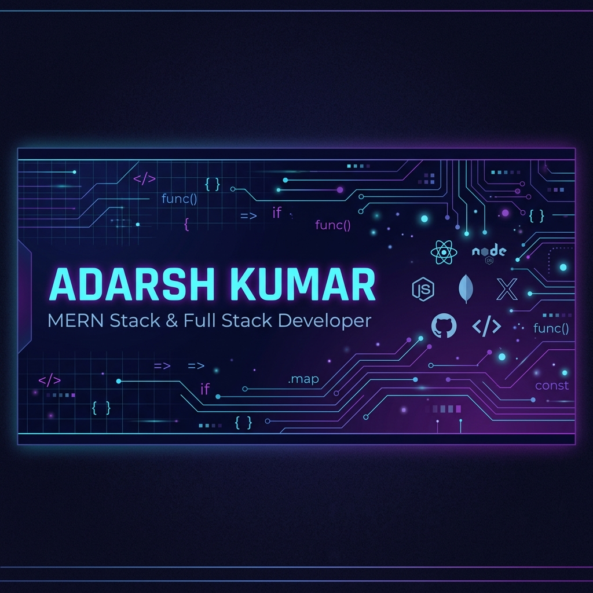

# 
👋 Hi, I'm Adarsh Kumar!

  

  
  
  
  

---

## 💫 About Me

> **Passionate MERN Stack Developer & CSE Graduate** | Building scalable, user-centric web applications | Currently training at **J Spider Training Institute**

I am a **B.Tech Computer Science & Engineering graduate** (Class of 2025) with a strong passion for building dynamic, responsive, and secure full-stack web applications. My expertise spans modern frontend frameworks, robust backend systems, and database management.

**Quick Highlights:**
- 🎓 **B.Tech CSE** from Patel College of Science and Technology, Bhopal (CGPA: 7.54/10)
- 🏫 **MERN Full Stack Developer Trainee** at J Spider Training Institute, Noida
- 📍 Based in **Noida, Uttar Pradesh** (Originally from Saharsa, Bihar)
- 💼 Seeking **Software Developer / MERN Stack / Full Stack** opportunities
- 🚀 Committed to writing clean, maintainable, and production-ready code
- 🌟 Passionate about solving real-world problems with technology
---

## 🛠️ Tech Stack & Skills

### 💻 Frontend Development

### ⚙️ Backend & API Development

### 🗄️ Databases & ORM

### 🔤 Programming Languages

### 🛠️ Tools & Technologies

---

## 🚀 Featured Projects

### 🏥 Hospital Management System
**A comprehensive medical management platform designed to streamline administrative tasks and improve doctor-patient interaction**

**Key Features:**
- ✅ Secure role-based access control (Admin, Doctors, Patients) with JWT authentication
- ✅ High-performance REST APIs for patient admissions, appointment bookings, and doctor schedules
- ✅ Data sanitization & error-handling middleware for system reliability
- ✅ Responsive UI with real-time updates and smooth user experience

**Tech Stack:**

**Links:** [📂 Code Repository](https://github.com/Adarshkumar459) | [🌐 Live Demo](https://github.com/Adarshkumar459)

---

### 📚 Book Store Web Application
**A full-stack e-commerce platform for book enthusiasts with robust search, inventory management, and seamless transactions**

**Key Features:**
- ✅ Complete CRUD operations for book management (Add, Read, Update, Delete)
- ✅ Advanced filtering & search capabilities with category-based browsing
- ✅ Secure shopping cart & checkout experience
- ✅ Responsive design optimized for all devices
- ✅ MongoDB schema optimization for high query performance

**Tech Stack:**

**Links:** [📂 Code Repository](https://github.com/Adarshkumar459) | [🌐 Live Demo](https://github.com/Adarshkumar459)

> 👉 **[View All Projects](https://github.com/Adarshkumar459?tab=repositories)** on my GitHub profile
---

## 📜 Training & Certifications

| 🏢 Institution | 📚 Course | 📅 Duration | 🎯 Focus |
|---|---|---|---|
| **J Spider Training Institute** | MERN Full Stack Development | March 2025 - Present | Advanced development & architectures |
| **Apna College & Udemy** | Java Programming & Development | Self-paced | OOP, Data Structures, Algorithms |
| **PW Skills** | MERN Stack Development Certification | Nov 2023 | Full Stack Development |
| **Excellent Computer Center** | C and C++ Programming | Nov 2022 | Core programming fundamentals |
---

## 📊 GitHub Analytics

  
  

  

---

## 🎯 Core Competencies

| Category | Skills |
|----------|--------|
| **Frontend** | React.js, JavaScript (ES6+), HTML5, CSS3, Tailwind CSS, Bootstrap, Responsive Design |
| **Backend** | Node.js, Express.js, RESTful APIs, Middleware, Authentication (JWT), Error Handling |
| **Databases** | MongoDB, MySQL, Mongoose ORM, Schema Design, Query Optimization |
| **Languages** | JavaScript, Java, C, C++, SQL |
| **Tools & Practices** | Git, GitHub, Postman, VS Code, NPM, Debugging, Version Control |
| **Soft Skills** | Problem-solving, Team Collaboration, Quick Learner, Self-motivated, Communication |

---

## 📈 Career Goals

🎯 **Short-term (Next 6 months):**
- Land an entry-level position as a MERN Stack Developer or Full Stack Developer
- Contribute to open-source projects and build a strong portfolio
- Master advanced JavaScript concepts and design patterns

🚀 **Long-term (1-2 years):**
- Become a proficient full-stack engineer with expertise in scalable architectures
- Lead development of high-impact web applications
- Mentor junior developers and contribute to tech community

---

## 💡 What I Bring to the Table

✨ **Problem Solver** - I approach challenges analytically and implement efficient solutions  
✨ **Quick Learner** - Adaptable to new technologies and frameworks with enthusiasm  
✨ **Detail-Oriented** - Focus on clean code, best practices, and maintainability  
✨ **Collaborative** - Excellent communication and teamwork skills  
✨ **Driven** - Passionate about continuous improvement and professional growth  

---

## 🤝 Let's Connect!

  <i>I'm always open to discussing new projects, opportunities, or collaboration ideas!</i>

  
  
  

---

  

  <b>⭐ If you found value in my profile, please consider giving my repositories a star! It means a lot!</b>

  <i>Last Updated: June 2025 | Actively seeking opportunities | Open to freelance projects</i>

